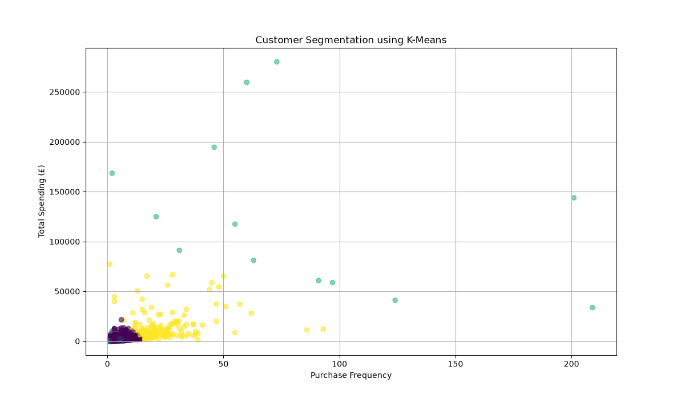

# Customer Segmentation Analysis using RFM Analysis and K-Means Clustering

## Project Overview

This project applies Customer Segmentation techniques to an online retail dataset using RFM (Recency, Frequency, Monetary) analysis and K-Means Clustering. The objective is to identify customer groups based on purchasing behaviour and generate business insights that can support targeted marketing strategies, customer retention, and revenue growth.

The project demonstrates data cleaning, exploratory data analysis, feature engineering, customer analytics, machine learning, and data visualisation using Python.

---

## Business Problem

Businesses often have thousands of customers with different purchasing behaviours. Treating all customers the same can lead to ineffective marketing campaigns and lost revenue opportunities.

This project aims to:

* Identify high-value customers
* Detect loyal customers
* Find customers at risk of churn
* Support personalised marketing strategies
* Improve customer retention and revenue generation

---

## Dataset

**Source:** UCI Machine Learning Repository – Online Retail Dataset

Dataset Information:

* Total Records: 541,909
* Features: 8
* Transactions from a UK-based online retailer
* Period: December 2010 – December 2011

### Features

| Column      | Description                |
| ----------- | -------------------------- |
| InvoiceNo   | Invoice number             |
| StockCode   | Product code               |
| Description | Product description        |
| Quantity    | Quantity purchased         |
| InvoiceDate | Date of transaction        |
| UnitPrice   | Product price              |
| CustomerID  | Unique customer identifier |
| Country     | Customer country           |

---

## Technologies Used

* Python
* Pandas
* NumPy
* Matplotlib
* Scikit-Learn
* K-Means Clustering
* VS Code
* Git & GitHub

---

## Project Workflow

### 1. Data Cleaning

The following preprocessing steps were performed:

* Removed missing Customer IDs
* Removed negative quantities
* Removed invalid prices
* Converted InvoiceDate to datetime format
* Created TotalAmount feature

### 2. Feature Engineering

Created:

```python
TotalAmount = Quantity × UnitPrice
```

### 3. RFM Analysis

RFM metrics were calculated for each customer:

#### Recency

Number of days since the customer's last purchase.

#### Frequency

Number of purchases made by the customer.

#### Monetary

Total spending by the customer.

### 4. Customer Segmentation

K-Means Clustering was applied to group customers into behavioural segments.

Number of clusters:

```python
n_clusters = 4
```

---

## Results

### Dataset Statistics

| Metric               | Value         |
| -------------------- | ------------- |
| Original Records     | 541,909       |
| Cleaned Records      | 397,884       |
| Unique Customers     | 4,338         |
| Total Sales Analysed | £8,911,407.90 |

---

## Customer Segments

### Cluster 0 – Regular Customers

* Largest customer group
* Moderate spending behaviour
* Moderate purchase frequency

Recommended Strategy:

* Product recommendations
* Loyalty programmes
* Retention campaigns

---

### Cluster 1 – At-Risk Customers

* Lower spending activity
* Less frequent purchases
* Potential churn risk

Recommended Strategy:

* Re-engagement campaigns
* Promotional discounts
* Personalised offers

---

### Cluster 2 – VIP Customers

* Highest spending customers
* Most valuable segment
* Significant revenue contribution

Recommended Strategy:

* VIP loyalty programmes
* Exclusive rewards
* Premium customer support

---

### Cluster 3 – High-Value Customers

* Frequent purchasers
* Strong spending behaviour
* High business value

Recommended Strategy:

* Upselling opportunities
* Cross-selling campaigns
* Priority marketing

---

## Visualisation

### Customer Segmentation using K-Means

The chart below visualises customer groups based on purchase frequency and total spending.




---

## Key Insights

* Identified 4 distinct customer groups.
* VIP customers represent a small percentage of the customer base but contribute significantly to revenue.
* Most customers belong to the Regular Customer segment.
* At-Risk customers present an opportunity for retention-focused marketing campaigns.
* Customer segmentation can improve targeting efficiency and business decision-making.

---

## Skills Demonstrated

* Data Cleaning
* Exploratory Data Analysis (EDA)
* Feature Engineering
* Customer Analytics
* RFM Modelling
* K-Means Clustering
* Machine Learning
* Data Visualisation
* Business Insight Generation
* GitHub Documentation

---

## Future Improvements

* Determine optimal clusters using the Elbow Method.
* Add interactive dashboards using Power BI or Streamlit.
* Deploy the project as a web application.
* Compare K-Means with hierarchical clustering techniques.
* Build customer churn prediction models.

---

## Author

**Nusrat Jahan Onia**

MSc Data Science & Artificial Intelligence

GitHub Portfolio:
https://github.com/Nus23/Data-Analyst-Portfolio
